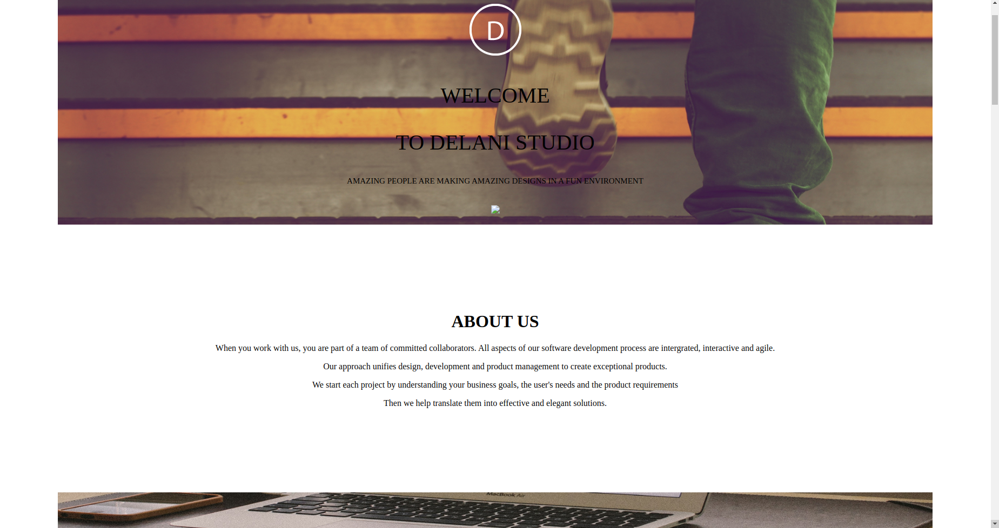

# DELANI STUDIO
#### By **Emmanuel Nakitare**
## Screenshot

## Description
Delani studio is a great application that allows different developers to work together on various projects. It enables a user share their business goals and get assistance in coding from a well-updated team.
## Setup/Installation Requirements

## Known Bugs
Once you type your message it may not display a pop-up message.
## Technologies Used
HTML
CSS
JQUERY
JAVASCRIPT
BOOTSTRAP
## Support and contact details
(emmanakitare10@gmail.com)
### License
*MIT License*
Copyright (c) 2020 
  